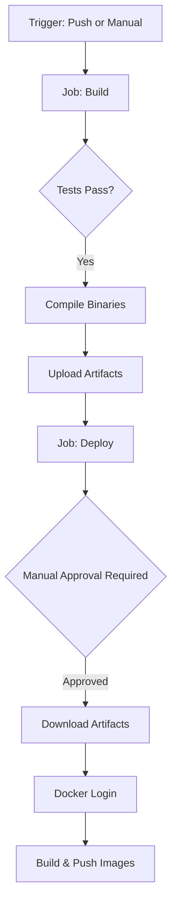

# Backend CI/CD Manual Approval Walkthrough

I have updated the `.github/workflows/backend.yml` to split the process into two jobs: **Build** and **Deploy**. This allows for a manual "click to start" step for the Docker image push.

## Changes Made

### 1. Workflow Split
The single job was split into two separate jobs to enable environment-based approvals:
- **`build` job**: Tests the code, builds the `backend` and `gateway` binaries on every push to `main`.
- **`deploy` job**: Strictly manual. You must navigate to the Actions tab and click **"Run workflow"** to trigger this job. It downloads the binaries and performs the Docker build and push.

### 2. Manual Approval with Environments
The `deploy` job is now associated with a GitHub `environment` called `production`.
```yaml
  deploy:
    needs: build
    runs-on: ubuntu-latest
    environment: production
```

### 3. Artifact Management
We use `actions/upload-artifact` and `actions/download-artifact` to pass the compiled binaries between the two jobs, ensuring that we only push exactly what was built and tested in the first step.

## How to Enable Manual Click-to-Start

To make the manual approval work, you **must** perform the following steps in your GitHub repository:

1.  Navigate to your repository on GitHub.com.
2.  Go to **Settings** > **Environments**.
3.  Click **New environment** and name it `production`.
4.  In the `production` environment settings, check **Required reviewers**.
5.  Search for and add yourself (or your team) as a reviewer.
6.  Click **Save protection rules**.

Once this is set up, every time the workflow runs (on push or manual trigger), the `deploy` job will wait for you to click **"Review deployments"** and then **"Approve and deploy"** before the Docker images are pushed.

## Final Workflow Structure


