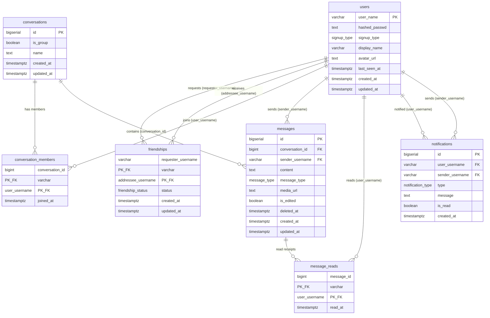

# Database Schema — Table Relationships

## Entity Relationship Diagram

---

## Tables

### `users`
Central table. Every other table references it.

| Column | Type | Notes |
|---|---|---|
| `user_name` | `VARCHAR(50)` | **PK** |
| `hashed_passwd` | `TEXT` | |
| `signup_type` | `signup_type` | `email`, `google`, `github` |
| `display_name` | `VARCHAR(100)` | nullable |
| `avatar_url` | `TEXT` | nullable |
| `last_seen_at` | `TIMESTAMPTZ` | nullable |
| `created_at` | `TIMESTAMPTZ` | |
| `updated_at` | `TIMESTAMPTZ` | |

---

### `friendships`
Tracks friend relationships. The primary key is `(requester_username, addressee_username)`. A `CHECK` constraint enforces canonical ordering (`requester < addressee`) so `(A,B)` and `(B,A)` cannot both exist.

| Column | Type | Notes |
|---|---|---|
| `requester_username` | `VARCHAR(50)` | **PK, FK** → `users.user_name` |
| `addressee_username` | `VARCHAR(50)` | **PK, FK** → `users.user_name` |
| `status` | `friendship_status` | `pending`, `accepted`, `rejected` |
| `created_at` | `TIMESTAMPTZ` | |
| `updated_at` | `TIMESTAMPTZ` | |

---

### `conversations`
A conversation is either a direct message (DM) or a group chat.

| Column | Type | Notes |
|---|---|---|
| `id` | `BIGSERIAL` | **PK** |
| `is_group` | `BOOLEAN` | `false` for DMs |
| `name` | `TEXT` | nullable — `NULL` for DMs, required for groups |
| `created_at` | `TIMESTAMPTZ` | |
| `updated_at` | `TIMESTAMPTZ` | |

---

### `conversation_members`
Join table linking users to the conversations they belong to.

| Column | Type | Notes |
|---|---|---|
| `conversation_id` | `BIGINT` | **PK, FK** → `conversations.id` (CASCADE) |
| `user_username` | `VARCHAR(50)` | **PK, FK** → `users.user_name` (CASCADE) |
| `joined_at` | `TIMESTAMPTZ` | |

---

### `messages`
Stores messages within a conversation. Supports soft-delete via `deleted_at`.

| Column | Type | Notes |
|---|---|---|
| `id` | `BIGSERIAL` | **PK** |
| `conversation_id` | `BIGINT` | **FK** → `conversations.id` (CASCADE) |
| `sender_username` | `VARCHAR(50)` | **FK** → `users.user_name` (CASCADE) |
| `content` | `TEXT` | |
| `message_type` | `message_type` | `text`, `image`, `file`, `audio` |
| `media_url` | `TEXT` | nullable — S3/CDN URL for non-text messages |
| `is_edited` | `BOOLEAN` | default `false` |
| `deleted_at` | `TIMESTAMPTZ` | nullable — `NULL` = not deleted (soft delete) |
| `created_at` | `TIMESTAMPTZ` | |
| `updated_at` | `TIMESTAMPTZ` | |

---

### `message_reads`
Per-user read receipts. One row per `(message, user)` pair.

| Column | Type | Notes |
|---|---|---|
| `message_id` | `BIGINT` | **PK, FK** → `messages.id` (CASCADE) |
| `user_username` | `VARCHAR(50)` | **PK, FK** → `users.user_name` (CASCADE) |
| `read_at` | `TIMESTAMPTZ` | |

---

### `notifications`
Notifies a user of an event.

| Column | Type | Notes |
|---|---|---|
| `id` | `BIGSERIAL` | **PK** |
| `user_username` | `VARCHAR(50)` | **FK** → `users.user_name` (CASCADE) |
| `sender_username` | `VARCHAR(50)` | **FK** → `users.user_name` (CASCADE) |
| `type` | `notification_type` | `message`, `friend_request` |
| `message` | `TEXT` | |
| `is_read` | `BOOLEAN` | default `false` |
| `created_at` | `TIMESTAMPTZ` | |

---

## Relationship Summary

| From | To | Via | Cardinality |
|---|---|---|---|
| `users` | `friendships` | `requester_username` | one-to-many |
| `users` | `friendships` | `addressee_username` | one-to-many |
| `users` | `conversation_members` | `user_username` | one-to-many |
| `conversations` | `conversation_members` | `conversation_id` | one-to-many |
| `conversations` | `messages` | `conversation_id` | one-to-many |
| `users` | `messages` | `sender_username` | one-to-many |
| `messages` | `message_reads` | `message_id` | one-to-many |
| `users` | `message_reads` | `user_username` | one-to-many |
| `users` | `notifications` | `user_username` | one-to-many |
| `users` | `notifications` | `sender_username` | one-to-many |

---

## Indexes

| Index | Table | Columns | Purpose |
|---|---|---|---|
| `idx_conv_members_user` | `conversation_members` | `user_username` | Look up all conversations a user belongs to |
| `idx_messages_conv_time` | `messages` | `(conversation_id, created_at ASC)` | Primary read pattern — messages in a conversation ordered by time |
| `idx_messages_conv_not_deleted` | `messages` | `(conversation_id, created_at ASC) WHERE deleted_at IS NULL` | Efficiently exclude soft-deleted rows |
| `idx_message_reads_user` | `message_reads` | `(user_username, message_id)` | Check which messages a user has read |
| `idx_notifications_user_read_time` | `notifications` | `(user_username, is_read, created_at DESC)` | User inbox sorted by time, filterable by read status |
| `idx_friendships_requester_status` | `friendships` | `(requester_username, status)` | Accepted friends lookup per user |
| `idx_friendships_addressee_status` | `friendships` | `(addressee_username, status)` | Accepted friends lookup per user (other side) |
| `idx_friendships_addressee_status_time` | `friendships` | `(addressee_username, status, created_at DESC)` | Pending incoming friend requests |
