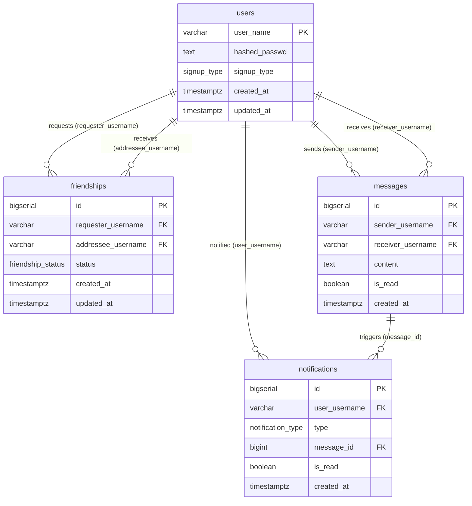

# Database Schema — Table Relationships

## Entity Relationship Diagram

---

## Tables

### `users`
Central table. Every other table references it.

| Column | Type | Notes |
|---|---|---|
| `user_name` | `VARCHAR(50)` | **PK** |
| `hashed_passwd` | `TEXT` | |
| `signup_type` | `signup_type` | `email`, `google`, `github` |
| `created_at` | `TIMESTAMPTZ` | |
| `updated_at` | `TIMESTAMPTZ` | |

---

### `friendships`
Tracks friend relationships. A pair [(requester, addressee)](file:///root/Documents/chat/backend/internal/handlers/auth_handler.go#16-17) is unique.

| Column | Type | Notes |
|---|---|---|
| [id](file:///root/Documents/chat/backend/internal/interceptors/jwt_test.go#30-39) | `BIGSERIAL` | **PK** |
| `requester_username` | `VARCHAR(50)` | **FK** → `users.user_name` |
| `addressee_username` | `VARCHAR(50)` | **FK** → `users.user_name` |
| `status` | `friendship_status` | `pending`, `accepted`, `rejected` |
| `created_at` | `TIMESTAMPTZ` | |
| `updated_at` | `TIMESTAMPTZ` | |

---

### `messages`
Stores direct messages between two users.

| Column | Type | Notes |
|---|---|---|
| [id](file:///root/Documents/chat/backend/internal/interceptors/jwt_test.go#30-39) | `BIGSERIAL` | **PK** |
| `sender_username` | `VARCHAR(50)` | **FK** → `users.user_name` |
| `receiver_username` | `VARCHAR(50)` | **FK** → `users.user_name` |
| `content` | `TEXT` | |
| `is_read` | `BOOLEAN` | default `false` |
| `created_at` | `TIMESTAMPTZ` | |

---

### `notifications`
Notifies a user of an event. Optionally linked to a specific message.

| Column | Type | Notes |
|---|---|---|
| [id](file:///root/Documents/chat/backend/internal/interceptors/jwt_test.go#30-39) | `BIGSERIAL` | **PK** |
| `user_username` | `VARCHAR(50)` | **FK** → `users.user_name` |
| `type` | `notification_type` | `message`, `friend_request` |
| `message_id` | `BIGINT` | **FK** → `messages.id` (nullable, `SET NULL` on delete) |
| `is_read` | `BOOLEAN` | default `false` |
| `created_at` | `TIMESTAMPTZ` | |

---

## Relationship Summary

| From | To | Via | Cardinality |
|---|---|---|---|
| `users` | `friendships` | `requester_username` | one-to-many |
| `users` | `friendships` | `addressee_username` | one-to-many |
| `users` | `messages` | `sender_username` | one-to-many |
| `users` | `messages` | `receiver_username` | one-to-many |
| `users` | `notifications` | `user_username` | one-to-many |
| `messages` | `notifications` | `message_id` | one-to-many (nullable) |
