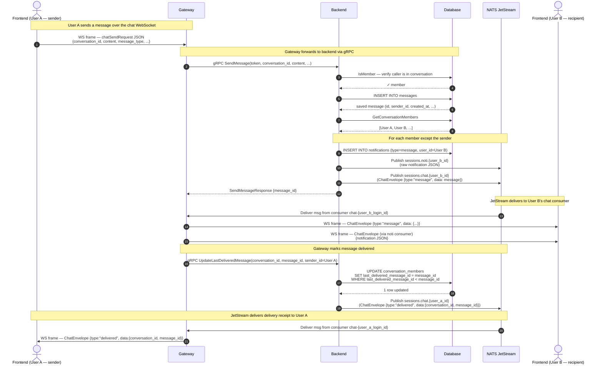
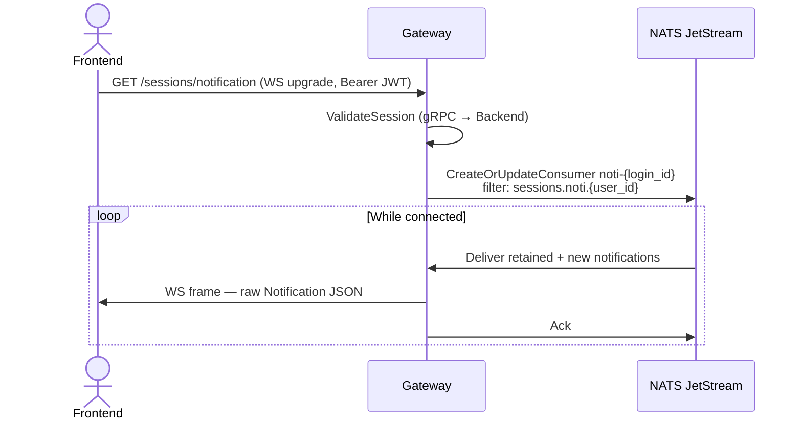

# Chat Streaming Architecture

This document describes the real-time message flow — from a sender's WebSocket frame through the backend to the recipient's WebSocket — using the actual components in this system.

## Components

| Component | Role |
|-----------|------|
| **Frontend** | React SPA; connects to two persistent WebSocket sessions (`/sessions/chat`, `/sessions/notification`) |
| **Gateway** | HTTP/WebSocket server; translates between REST/WS clients and gRPC backend, and owns the NATS JetStream consumers |
| **Backend** | gRPC server; handles all business logic, DB writes, and NATS publishes |
| **NATS JetStream** | Message bus with durable consumers; provides offline delivery guarantees |
| **Database** | PostgreSQL; persists messages, notifications, `last_delivered_message_id` |

## NATS Stream Configuration

The Gateway creates a single stream at startup:

| Property | Value |
|----------|-------|
| **Stream name** | `SESSIONS` |
| **Subjects** | `sessions.noti.>`, `sessions.chat.>` |
| **Storage** | File (persists to disk) |
| **Max age** | 24 hours |

Each connected device (identified by `login_id` from the JWT) creates or resumes two durable consumers:

| Consumer | Durable name | Filter subject |
|----------|-------------|----------------|
| Chat | `chat-{login_id}` | `sessions.chat.{user_id}` |
| Notification | `noti-{login_id}` | `sessions.noti.{user_id}` |

Because consumers are per-`login_id`, multiple devices logged in as the same user each receive every message independently.

---

## Message Send & Delivery Receipt Flow



---

## Offline Delivery

If User B is not connected when the message is published:

1. NATS JetStream **retains** the message in the `SESSIONS` stream (up to 24 hours).
2. The durable consumer `chat-{user_b_login_id}` remembers its position.
3. When User B reconnects and re-establishes `/sessions/chat`, the Gateway resumes the existing consumer — all unacknowledged messages are replayed immediately.
4. After each replayed message is written to the WebSocket, the Gateway calls `UpdateLastDeliveredMessage` — only the highest undelivered ID causes a DB update (the SQL guard `AND last_delivered_message_id < $new_id` prevents regressions).

---

## Notification Session Flow

The `/sessions/notification` WebSocket runs a separate durable consumer (`noti-{login_id}`) on `sessions.noti.{user_id}`. It delivers raw `Notification` JSON objects (persisted in the DB) for events such as incoming messages, friend requests, and friend request responses. The same offline-delivery guarantee applies.



---

## Envelope Format Reference

All server-to-client chat WebSocket frames use this structure:

```json
{
  "version": 1,
  "type": "message | delivered",
  "data": { ... }
}
```

| `type` | `data` payload |
|--------|---------------|
| `"message"` | Full `Message` row from DB (`id`, `conversation_id`, `sender_id`, `content`, `message_type`, `created_at`, ...) |
| `"delivered"` | `{ "conversation_id": 42, "message_id": 149 }` |
