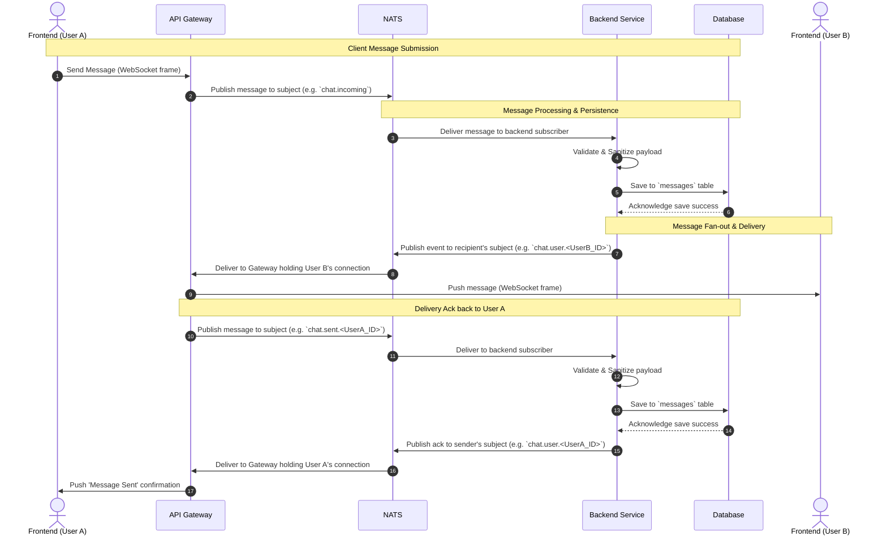

# Chat Streaming Architecture

This document analyzes the architecture for real-time chat streaming using WebSockets, an inline Gateway, a NATS message queue, and a Backend interacting with a Database.

## Sequence Diagram

This sequence diagram illustrates the step-by-step flow of sending a message from one user to another. It includes the path from the sender's frontend down to the database, and back up to the recipient's frontend.

