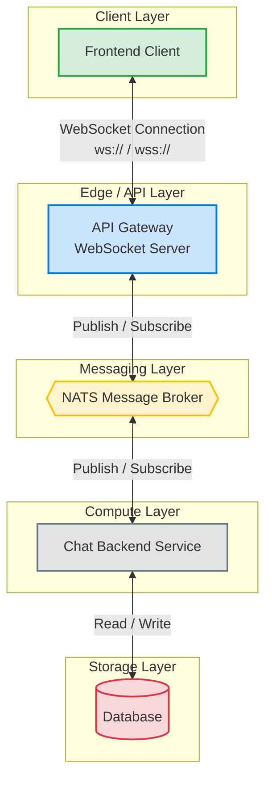
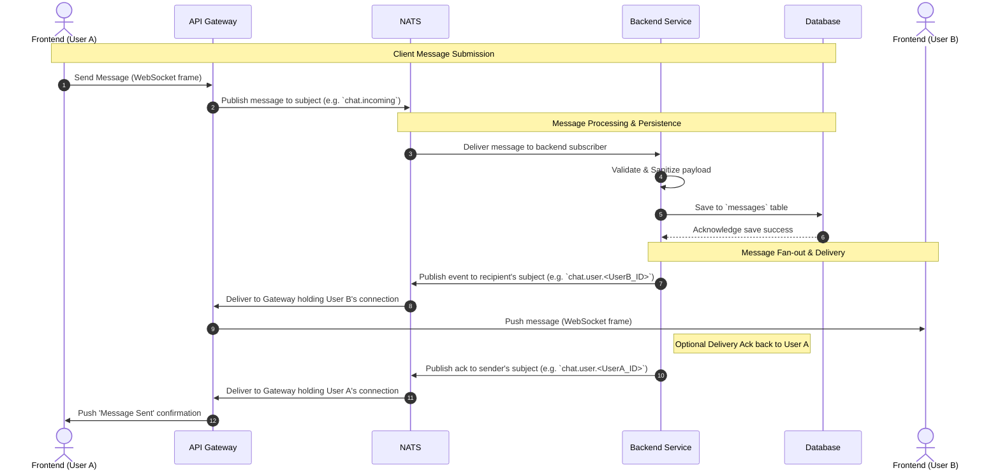

# Chat Streaming Architecture

This document analyzes the architecture for real-time chat streaming using WebSockets, an inline Gateway, a NATS message queue, and a Backend interacting with a Database.

## Architecture Analysis

The proposed architecture introduces a robust, decoupled, and scalable approach to handling real-time chat:

1. **Frontend**: Establishes a persistent, full-duplex WebSocket connection to the Gateway. This allows for low-latency, real-time message pushing and receiving without the overhead of HTTP polling.
2. **Gateway**: Acts as the connection manager. It terminates the WebSocket connections from thousands of clients, handling the stateful connections. It translates incoming WebSocket frames into NATS messages and vice-versa, effectively offloading connection management from the core backend services.
3. **NATS Message Queue**: Serves as the high-performance central nervous system of the chat architecture. It decouples the Gateway and Backend. Gateways publish messages to subjects, and Backends subscribe to them. NATS supports publish-subscribe patterns which are perfect for routing messages to specific users or chat rooms.
4. **Backend**: Contains the core business logic. As a stateless service, it subscribes to NATS, processes incoming messages (e.g., validation, sanitization, saving to the database), and then publishes the necessary outgoing messages or events back to NATS for distribution to recipients.
5. **Database (DB)**: The persistent storage layer maintaining chat histories, user states, and conversational metadata. The database is accessed securely and exclusively by the Backend.

### Key Benefits
- **Scalability**: The Gateway layer can be scaled horizontally to support more concurrent WebSocket connections. The Backend layer can be scaled independently to support higher message processing throughput.
- **Decoupling**: If the Backend crashes or is redeployed, the Gateway can maintain the open WebSocket connections with the Frontend, preventing mass disconnects. 
- **Performance**: NATS provides extremely low-latency messaging between the Gateway and Backend components.

---

## Flow Diagram

This diagram visualizes the high-level components and the protocols used for communication between them.

---

## Sequence Diagram

This sequence diagram illustrates the step-by-step flow of sending a message from one user to another. It includes the path from the sender's frontend down to the database, and back up to the recipient's frontend.

