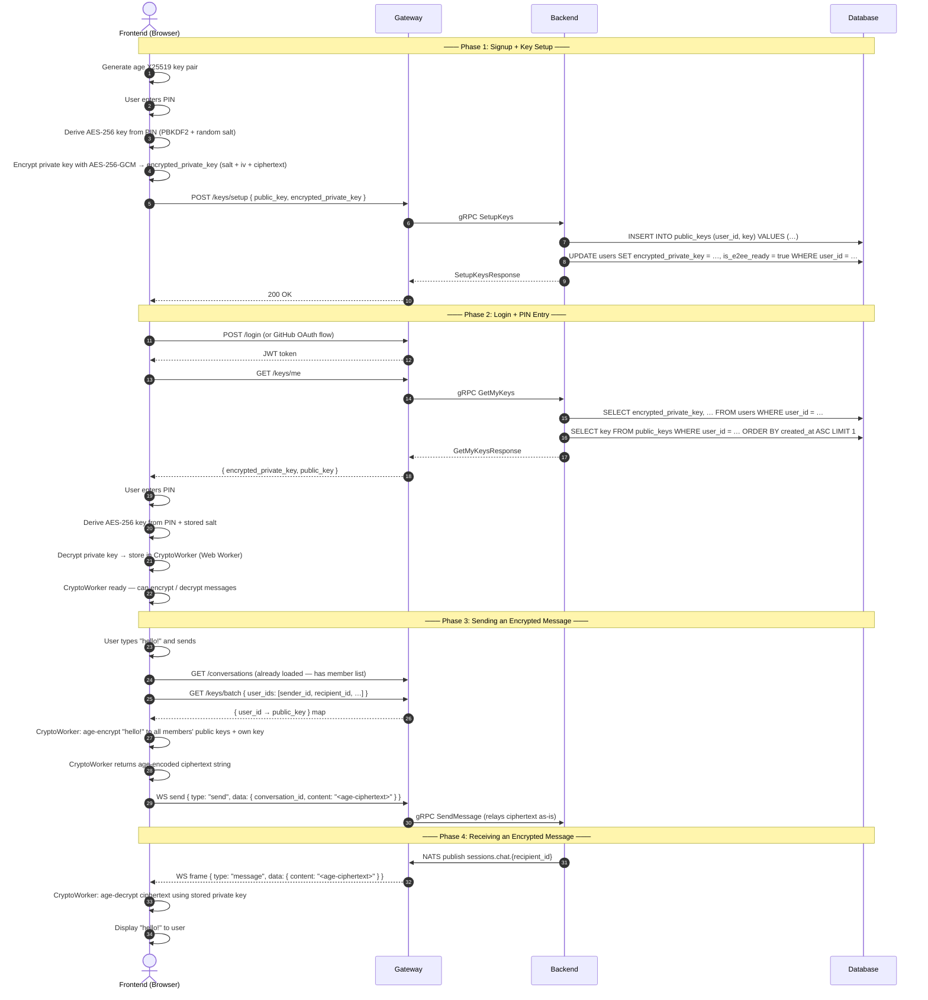

# End-to-End Encryption (E2EE) Implementation Plan

This document details the step-by-step implementation plan for adding end-to-end encryption to the chat application using age encryption (X25519 keys). Messages are encrypted client-side; the backend never sees plaintext message content.

---

## Architecture Overview

Every user owns an age X25519 key pair. The public key is shared (stored on the server) so that anyone can encrypt messages to the user. The private key is encrypted with a user-chosen PIN and stored on the server — the server never sees the unencrypted private key. When the user opens a new browser tab, they must enter their PIN to decrypt the private key into a Web Worker's memory, where it stays for the session lifetime.



---

## Key Format Reference

| Item | Format | Example |
|------|--------|---------|
| Age public key (X25519) | Bech32, starts with `age1` | `age1qyqsz4g9q2ck3v9x2v9h9tyw7kq3v9x2v9h9tyw7k` |
| Age private key (X25519) | Bech32, starts with `AGE-SECRET-KEY-1` | `AGE-SECRET-KEY-1QYQSZ4G9Q2CK3V9X2V9H9TYW7KQ3V9X` |
| PIN-encrypted private key | Base64 string: `salt(32B) + iv(12B) + ciphertext(varies) + tag(16B)` | see §4 below |
| Age-encrypted message | Age armor format (base64 with header stanzas) | Standard age encoding |

### Why Age Encryption

- Age is a modern, well-audited encryption format with a simple specification.
- Natively supports encrypting to **multiple recipients** — the message body is encrypted once with a random file key, and a separate header stanza is added for each recipient's public key. Any single private key can decrypt the entire message.
- There are JavaScript/TypeScript implementations (`age-encryption` npm package) suitable for browser use.
- The Go reference implementation (`filippo.io/age`) is available for potential backend use (though the backend never decrypts messages).

---

## 1. Database Changes

### 1.1 Add `is_e2ee_ready` Column to `users`

**File:** `backend/sqls/init/schema.sql`

```sql
ALTER TABLE users ADD COLUMN IF NOT EXISTS is_e2ee_ready BOOLEAN NOT NULL DEFAULT false;
```

This column gates whether the user has completed E2EE key setup. Until `is_e2ee_ready = true`, the user cannot send or receive encrypted messages.

### 1.2 Update SQL Queries

**File:** `backend/sqls/queries/users.sql`

Add `encrypted_private_key` and `is_e2ee_ready` to all relevant queries:

```sql
-- name: GetUserByID :one
SELECT user_id, user_name, hashed_passwd, signup_type, display_name, avatar_url, encrypted_private_key, is_e2ee_ready, last_seen_at, created_at, updated_at
FROM users
WHERE user_id = $1
LIMIT 1;

-- name: GetUserByUsername :one
SELECT user_id, user_name, hashed_passwd, signup_type, display_name, avatar_url, encrypted_private_key, is_e2ee_ready, last_seen_at, created_at, updated_at
FROM users
WHERE user_name = $1
LIMIT 1;

-- name: CreateUser :one
INSERT INTO users (user_name, hashed_passwd, signup_type)
VALUES ($1, $2, $3)
RETURNING user_id, user_name, hashed_passwd, signup_type, display_name, avatar_url, encrypted_private_key, is_e2ee_ready, last_seen_at, created_at, updated_at;

-- name: UpdateUserProfile :one
UPDATE users
SET display_name = $2,
    avatar_url   = $3,
    updated_at   = NOW()
WHERE user_name = $1
RETURNING user_id, user_name, hashed_passwd, signup_type, display_name, avatar_url, encrypted_private_key, is_e2ee_ready, last_seen_at, created_at, updated_at;

-- name: SetE2EEKeys :exec
UPDATE users
SET encrypted_private_key = $2,
    is_e2ee_ready         = true,
    updated_at            = NOW()
WHERE user_id = $1;

-- name: GetE2EEKeysByUserID :one
SELECT encrypted_private_key, is_e2ee_ready
FROM users
WHERE user_id = $1;
```

### 1.3 Add Batch Public Key Lookup Query

**File:** `backend/sqls/queries/public_keys.sql`

```sql
-- name: GetPublicKeysByUserIDs :many
SELECT id, user_id, key, created_at, updated_at
FROM public_keys
WHERE user_id = ANY($1::uuid[])
ORDER BY created_at ASC;

-- name: GetLatestPublicKeyByUserID :one
SELECT id, user_id, key, created_at, updated_at
FROM public_keys
WHERE user_id = $1
ORDER BY created_at DESC
LIMIT 1;
```

After modifying SQL queries, regenerate Go code:

```sh
cd backend && sqlc generate
```

---

## 2. Proto Changes

**File:** `backend/proto/auth/auth.proto`

Add key management RPCs to the `Auth` service:

```protobuf
// --- E2EE Key Management ---

message SetupKeysRequest {
  string public_key = 1;                // age X25519 public key (age1...)
  string encrypted_private_key = 2;     // PIN-encrypted private key (base64)
}

message SetupKeysResponse {
  bool is_e2ee_ready = 1;
}

message GetMyKeysResponse {
  string encrypted_private_key = 1;      // base64-encoded PIN-encrypted private key
  string public_key = 2;                // age X25519 public key
  bool is_e2ee_ready = 3;
}

message GetPublicKeysRequest {
  repeated string user_ids = 1;          // UUIDs of users whose public keys to fetch
}

message PublicKeyEntry {
  string user_id = 1;
  string public_key = 2;                // age X25519 public key
}

message GetPublicKeysResponse {
  repeated PublicKeyEntry keys = 1;
}

service Auth {
  // ... existing RPCs ...
  rpc SetupKeys(SetupKeysRequest) returns (SetupKeysResponse);
  rpc GetMyKeys(GetMyKeysRequest) returns (GetMyKeysResponse);
  rpc GetPublicKeys(GetPublicKeysRequest) returns (GetPublicKeysResponse);
}
```

> **Note:** `GetMyKeysRequest` has no fields — the user ID is extracted from the JWT in the gRPC context (set by the JWT interceptor).

After editing, regenerate Go code:

```sh
cd backend && protoc --go_out=. --go-grpc_out=. proto/auth/auth.proto
```

---

## 3. gRPC Service Implementation

**File:** `backend/internal/services/auth_service.go`

Add three new methods to `AuthServer`.

### 3.1 `SetupKeys`

- Extracts `user_id` from context (set by JWT interceptor).
- Validates that `public_key` is not empty and starts with `age1`.
- Validates that `encrypted_private_key` is not empty.
- Calls `CreatePublicKey` to insert the public key into `public_keys`.
- Calls `SetE2EEKeys` to update `users.encrypted_private_key` and set `is_e2ee_ready = true`.
- Returns `SetupKeysResponse { is_e2ee_ready: true }`.

### 3.2 `GetMyKeys`

- Extracts `user_id` from context.
- Calls `GetE2EEKeysByUserID` to get `encrypted_private_key` and `is_e2ee_ready`.
- Calls `GetLatestPublicKeyByUserID` to get the user's most recent public key.
- Returns both values. If the user hasn't set up keys yet, `encrypted_private_key` is empty and `is_e2ee_ready` is false.
- **This endpoint is also called on every login / new tab** — the frontend uses the response to determine whether to show the PIN entry screen or the key setup screen.

### 3.3 `GetPublicKeys`

- Takes a list of user IDs.
- Calls `GetPublicKeysByUserIDs` to fetch the **latest** public key for each user.
- For each user ID, returns the public key with the highest `created_at`.
- If a user ID has no public key, skip that user.

### Error Handling Summary

| RPC | Scenario | gRPC Code |
|-----|----------|-----------|
| `SetupKeys` | Missing `public_key` | `InvalidArgument` |
| `SetupKeys` | `public_key` doesn't start with `age1` | `InvalidArgument` |
| `SetupKeys` | Missing `encrypted_private_key` | `InvalidArgument` |
| `SetupKeys` | User not found | `NotFound` |
| `SetupKeys` | Keys already set up | `AlreadyExists` |
| `SetupKeys` | DB error | `Internal` |
| `GetMyKeys` | User not found | `NotFound` |
| `GetPublicKeys` | Empty `user_ids` | `InvalidArgument` |
| `GetPublicKeys` | User not found (for a given ID) | Key omitted from response |

---

## 4. JWT Interceptor Whitelist

**File:** `backend/internal/interceptors/jwt.go`

No changes needed. All three new RPCs require authentication (the user must be logged in to manage their keys). None are added to `publicMethods`.

---

## 5. Gateway gRPC Client

**File:** `backend/internal/clients/auth_client.go`

Add three new methods:

```go
func (a *AuthClient) SetupKeys(ctx context.Context, token, publicKey, encryptedPrivateKey string) (bool, error) {
    resp, err := a.client.SetupKeys(
        lib.WithToken(ctx, token),
        &auth.SetupKeysRequest{
            PublicKey:           publicKey,
            EncryptedPrivateKey: encryptedPrivateKey,
        },
    )
    if err != nil {
        return false, err
    }
    return resp.IsE2EeReady, nil
}

func (a *AuthClient) GetMyKeys(ctx context.Context, token string) (encryptedPrivateKey, publicKey string, isE2eeReady bool, err error) {
    resp, err := a.client.GetMyKeys(
        lib.WithToken(ctx, token),
        &auth.GetMyKeysRequest{},
    )
    if err != nil {
        return "", "", false, err
    }
    return resp.EncryptedPrivateKey, resp.PublicKey, resp.IsE2EeReady, nil
}

func (a *AuthClient) GetPublicKeys(ctx context.Context, token string, userIDs []string) (map[string]string, error) {
    resp, err := a.client.GetPublicKeys(
        lib.WithToken(ctx, token),
        &auth.GetPublicKeysRequest{UserIds: userIDs},
    )
    if err != nil {
        return nil, err
    }
    m := make(map[string]string, len(resp.Keys))
    for _, k := range resp.Keys {
        m[k.UserId] = k.PublicKey
    }
    return m, nil
}
```

---

## 6. Gateway HTTP Handlers

**File:** `backend/internal/handlers/auth_handler.go`

### 6.1 `SetupKeys`

- **Route:** `POST /keys/setup`
- **Auth required:** Yes
- **Request body:**

```json
{
  "public_key": "age1qyqsz4g9q2ck3v9x2v9h9tyw7kq3v9x2v9h9tyw7k",
  "encrypted_private_key": "base64-encoded-blob"
}
```

- **Response (200):**

```json
{
  "success": true,
  "message": "keys set up successfully",
  "data": {
    "is_e2ee_ready": true
  }
}
```

- **Error responses:** 400 (invalid body), 401 (unauthorized), 409 (already set up), 500 (server error)

### 6.2 `GetMyKeys`

- **Route:** `GET /keys/me`
- **Auth required:** Yes
- **Response (200):**

```json
{
  "success": true,
  "data": {
    "encrypted_private_key": "base64-encoded-blob",
    "public_key": "age1qyqsz4g9q2ck3v9x2v9h9tyw7kq3v9x2v9h9tyw7k",
    "is_e2ee_ready": true
  }
}
```

If the user hasn't set up keys yet:

```json
{
  "success": true,
  "data": {
    "encrypted_private_key": "",
    "public_key": "",
    "is_e2ee_ready": false
  }
}
```

### 6.3 `GetPublicKeys`

- **Route:** `POST /keys/batch`
- **Auth required:** Yes
- **Request body:**

```json
{
  "user_ids": [
    "550e8400-e29b-41d4-a716-446655440000",
    "660e8400-e29b-41d4-a716-446655440001"
  ]
}
```

- **Response (200):**

```json
{
  "success": true,
  "data": {
    "550e8400-e29b-41d4-a716-446655440000": "age1qyqsz4g9q2ck3v9x2v9h9tyw7kq3v9x2v9h9tyw7k",
    "660e8400-e29b-41d4-a716-446655440001": "age1abc123..."
  }
}
```

### 6.4 Handler Code (Pseudocode)

```go
func (h *AuthHandler) SetupKeys(w http.ResponseWriter, r *http.Request) {
    token, ok := lib.BearerToken(r)
    if !ok || token == "" {
        lib.WriteJSON(w, http.StatusUnauthorized, lib.Response{Success: false, Message: "missing or malformed Authorization header"})
        return
    }
    var req struct {
        PublicKey           string `json:"public_key"`
        EncryptedPrivateKey string `json:"encrypted_private_key"`
    }
    if err := json.NewDecoder(r.Body).Decode(&req); err != nil {
        lib.WriteJSON(w, http.StatusBadRequest, lib.Response{Success: false, Message: "invalid request body"})
        return
    }
    isReady, err := h.authClient.SetupKeys(r.Context(), token, req.PublicKey, req.EncryptedPrivateKey)
    // ... error handling ...
    lib.WriteJSON(w, http.StatusOK, lib.Response{Success: true, Message: "keys set up successfully", Data: map[string]bool{"is_e2ee_ready": isReady}})
}

func (h *AuthHandler) GetMyKeys(w http.ResponseWriter, r *http.Request) {
    token, ok := lib.BearerToken(r)
    if !ok || token == "" {
        lib.WriteJSON(w, http.StatusUnauthorized, lib.Response{Success: false, Message: "missing or malformed Authorization header"})
        return
    }
    encPrivKey, pubKey, isReady, err := h.authClient.GetMyKeys(r.Context(), token)
    // ... error handling ...
    lib.WriteJSON(w, http.StatusOK, lib.Response{Success: true, Data: map[string]any{
        "encrypted_private_key": encPrivKey,
        "public_key":            pubKey,
        "is_e2ee_ready":         isReady,
    }})
}

func (h *AuthHandler) GetPublicKeys(w http.ResponseWriter, r *http.Request) {
    token, ok := lib.BearerToken(r)
    if !ok || token == "" {
        lib.WriteJSON(w, http.StatusUnauthorized, lib.Response{Success: false, Message: "missing or malformed Authorization header"})
        return
    }
    var req struct {
        UserIDs []string `json:"user_ids"`
    }
    if err := json.NewDecoder(r.Body).Decode(&req); err != nil {
        lib.WriteJSON(w, http.StatusBadRequest, lib.Response{Success: false, Message: "invalid request body"})
        return
    }
    keys, err := h.authClient.GetPublicKeys(r.Context(), token, req.UserIDs)
    // ... error handling ...
    lib.WriteJSON(w, http.StatusOK, lib.Response{Success: true, Data: keys})
}
```

### 6.5 New Request Types

**File:** `backend/internal/handlers/types.go`

```go
type setupKeysRequest struct {
    PublicKey           string `json:"public_key"`
    EncryptedPrivateKey string `json:"encrypted_private_key"`
}

type getPublicKeysRequest struct {
    UserIDs []string `json:"user_ids"`
}
```

---

## 7. Gateway Route Registration

**File:** `backend/cmd/gateway/main.go`

```go
r.HandleFunc("/keys/setup", authHandler.SetupKeys).Methods(http.MethodPost)
r.HandleFunc("/keys/me", authHandler.GetMyKeys).Methods(http.MethodGet)
r.HandleFunc("/keys/batch", authHandler.GetPublicKeys).Methods(http.MethodPost)
```

---

## 8. Backend Service Registration

**File:** `backend/cmd/backend/main.go`

No changes needed. The existing `auth.RegisterAuthServer(srv, services.NewAuthServer(sqlDB))` picks up all methods of the `Auth` service automatically.

---

## 9. Authentication Flow Changes

### 9.1 Current Flow

```
User logs in → JWT stored in cookie → PrivateRoute redirects to HomePage
```

### 9.2 New Flow

```
User logs in → JWT stored in cookie → Check is_e2ee_ready
  ├─ is_e2ee_ready = false → Redirect to /key-setup (generate keys + enter PIN)
  └─ is_e2ee_ready = true  → Redirect to /pin-entry (enter PIN to decrypt private key)
       ├─ PIN correct → Private key stored in CryptoWorker → HomePage
       └─ PIN wrong → Show error, re-prompt
```

### 9.3 Key Setup Flow (First-Time Users)

After successful signup (GitHub OAuth or email), the frontend must:

1. **Generate** an age X25519 key pair:
   ```ts
   const identity = await age.identity.generate()
   const publicKey = identity.publicKey  // "age1..."
   const privateKey = identity.toBech32String()  // "AGE-SECRET-KEY-1..."
   ```

2. **Prompt** the user to enter a PIN (minimum 4 characters; recommended 6+ characters for security).

3. **Encrypt** the private key with the PIN:
   ```ts
   // Derive a 256-bit AES key from the PIN using PBKDF2
   const salt = crypto.getRandomValues(new Uint8Array(32))
   const deriveKey = await crypto.subtle.importKey(
     'raw',
     new TextEncoder().encode(pin),
     'PBKDF2',
     false,
     ['deriveKey']
   )
   const aesKey = await crypto.subtle.deriveKey(
     { name: 'PBKDF2', salt, iterations: 600000, hash: 'SHA-256' },
     deriveKey,
     { name: 'AES-GCM', length: 256 },
     false,
     ['encrypt', 'decrypt']
   )

   // Encrypt the private key with AES-256-GCM
   const iv = crypto.getRandomValues(new Uint8Array(12))
   const encodedPrivateKey = new TextEncoder().encode(privateKey)
   const encrypted = await crypto.subtle.encrypt(
     { name: 'AES-GCM', iv },
     aesKey,
     encodedPrivateKey
   )

   // Encode as base64: salt (32B) + iv (12B) + ciphertext + tag (16B)
   const encryptedPrivateKey = btoa(String.fromCharCode(...salt, ...iv, ...new Uint8Array(encrypted)))
   ```

4. **Send** to the backend:
   ```ts
   await fetch(`${gatewayUrl}/keys/setup`, {
     method: 'POST',
     headers: {
       'Content-Type': 'application/json',
       'Authorization': `Bearer ${token}`,
     },
     body: JSON.stringify({ public_key: publicKey, encrypted_private_key: encryptedPrivateKey }),
   })
   ```

5. **Store** the private key in the CryptoWorker (see §10).

6. **Discard** the PIN and the derived AES key from memory.

### 9.4 PIN Entry Flow (Returning Users)

On every new browser tab / page load where the user is already authenticated:

1. **Fetch** E2EE key status from `GET /keys/me`.
2. If `is_e2ee_ready` is false, redirect to `/key-setup`.
3. If `is_e2ee_ready` is true, show PIN entry modal.
4. **Decrypt** the private key:
   ```ts
   // Decode base64 → extract salt, iv, ciphertext
   const raw = Uint8Array.from(atob(encryptedPrivateKey), c => c.charCodeAt(0))
   const salt = raw.slice(0, 32)
   const iv = raw.slice(32, 44)
   const ciphertext = raw.slice(44)

   // Derive AES key from PIN using same PBKDF2 parameters
   const aesKey = await deriveAESKeyFromPin(pin, salt)  // Same as step 3 above

   // Decrypt
   const decrypted = await crypto.subtle.decrypt(
     { name: 'AES-GCM', iv },
     aesKey,
     ciphertext
   )
   const privateKey = new TextDecoder().decode(decrypted)
   // If decryption fails (DOMException: OperationError), the PIN is wrong
   ```

5. **Post** the private key to the CryptoWorker:
   ```ts
   cryptoWorker.postMessage({ type: 'setPrivateKey', privateKey })
   ```

6. **Discard** the PIN, derived key, and `privateKey` string from main-thread memory:
   ```ts
   privateKey = null  // Hint to GC; the string is no longer referenced
   ```

### 9.5 Private Route Guard Update

**File:** `web/src/components/PrivateRoute.tsx`

The `PrivateRoute` component must be updated to check `is_e2ee_ready` after verifying authentication:

1. If the JWT is valid, call `GET /keys/me`.
2. If `is_e2ee_ready` is false, redirect to `/key-setup`.
3. If `is_e2ee_ready` is true and the CryptoWorker doesn't have a private key, show the PIN entry modal.
4. Only render the protected content once the CryptoWorker confirms it has an unlocked private key.

---

## 10. CryptoWorker (Web Worker)

The CryptoWorker is a dedicated Web Worker that holds the decrypted private key in a closure-scoped variable. The main thread communicates with it via `postMessage`.

### 10.1 Why a Web Worker?

- A Web Worker runs in a separate JavaScript context. The main thread **cannot** directly read variables inside the worker.
- This provides significantly better protection than a module-scoped variable in the main thread, which is trivially accessible via the browser console or a XSS attack that injects code into the same context.
- While not a substitute for proper XSS mitigation, it raises the bar: an attacker would need to exploit the worker's message channel or use a debugger, as opposed to simply reading a global variable.

### 10.2 Worker File

**File:** `web/src/cryptoWorker.ts`

```ts
importScripts('https://cdn.jsdelivr.net/npm/age-encryption@0.5.0/dist.browser/age-encryption.js')
// Or bundle the age library with the worker

let privateKey: string | null = null

self.onmessage = async (event: MessageEvent) => {
  const { type, data, id } = event.data

  switch (type) {
    case 'setPrivateKey':
      privateKey = data.privateKey
      self.postMessage({ type: 'privateKeySet', id })
      break

    case 'encrypt': {
      if (!privateKey) {
        self.postMessage({ type: 'error', id, data: { code: 400, message: 'private key not available' } })
        break
      }
      try {
        // data: { plaintext, recipients: string[] }
        // recipients are age public keys
        const ciphertext = await ageEncrypt(data.plaintext, data.recipients)
        self.postMessage({ type: 'encrypted', id, data: { ciphertext } })
      } catch (err: any) {
        self.postMessage({ type: 'error', id, data: { code: 500, message: err.message } })
      }
      break
    }

    case 'decrypt': {
      if (!privateKey) {
        self.postMessage({ type: 'error', id, data: { code: 400, message: 'private key not available' } })
        break
      }
      try {
        const plaintext = await ageDecrypt(data.ciphertext, privateKey)
        self.postMessage({ type: 'decrypted', id, data: { plaintext } })
      } catch (err: any) {
        self.postMessage({ type: 'error', id, data: { code: 500, message: err.message } })
      }
      break
    }

    case 'clearPrivateKey':
      privateKey = null
      self.postMessage({ type: 'privateKeyCleared', id })
      break

    case 'hasPrivateKey':
      self.postMessage({ type: 'hasPrivateKeyResult', id, data: { available: privateKey !== null } })
      break

    default:
      self.postMessage({ type: 'error', id, data: { code: 400, message: `unknown type: ${type}` } })
  }
}
```

### 10.3 Wrapper Module

**File:** `web/src/crypto.ts`

```ts
let worker: Worker | null = null
let requestId = 0
const pending = new Map<number, { resolve: (value: any) => void; reject: (err: Error) => void }>()

function getWorker(): Worker {
  if (!worker) {
    worker = new Worker(new URL('./cryptoWorker.ts', import.meta.url), { type: 'module' })
    worker.onmessage = (event) => {
      const { id, type, data } = event.data
      const p = pending.get(id)
      if (p) {
        pending.delete(id)
        if (type === 'error') {
          p.reject(new Error(data.message))
        } else {
          p.resolve(data)
        }
      }
    }
  }
  return worker
}

function send(type: string, data: any): Promise<any> {
  return new Promise((resolve, reject) => {
    const id = ++requestId
    pending.set(id, { resolve, reject })
    getWorker().postMessage({ type, data, id })
  })
}

export function setPrivateKey(privateKey: string): Promise<void> {
  return send('setPrivateKey', { privateKey }).then(() => {})
}

export function encrypt(plaintext: string, recipients: string[]): Promise<string> {
  return send('encrypt', { plaintext, recipients }).then(d => d.ciphertext)
}

export function decrypt(ciphertext: string): Promise<string> {
  return send('decrypt', { ciphertext }).then(d => d.plaintext)
}

export function clearPrivateKey(): Promise<void> {
  return send('clearPrivateKey', {}).then(() => {})
}

export function hasPrivateKey(): Promise<boolean> {
  return send('hasPrivateKey', {}).then(d => d.available)
}
```

### 10.4 Key Generation

The frontend must generate age X25519 key pairs. Two options:

1. **Use the `age-encryption` npm package** (recommended) — provides `age.identity.generate()` and `age.identity.publicKey()` functions.
2. **Use the Web Crypto API** with X25519 key generation — then format as age keys.

The recommended approach is to add `age-encryption` as a dependency:

```sh
cd web && npm install age-encryption
```

---

## 11. Frontend Pages and Components

### 11.1 New Route: `/key-setup`

**File:** `web/src/pages/KeySetupPage.tsx`

This page is shown to users who have not yet set up E2EE keys (i.e., `is_e2ee_ready = false`).

**Behavior:**

1. Generate an age X25519 key pair.
2. Display a disclaimer: "Your private key will be encrypted with a PIN you choose. If you forget your PIN, you cannot recover your messages. Please remember it."
3. PIN input (entered twice for confirmation).
4. On submit:
   - Encrypt the private key with the PIN.
   - Call `POST /keys/setup` with `{ public_key, encrypted_private_key }`.
   - On success, send the private key to the CryptoWorker.
   - Redirect to `/` (home page).

### 11.2 New Route: `/pin-entry`

**File:** `web/src/pages/PinEntryPage.tsx`

This page (or modal) is shown to returning users who have already set up E2EE keys but need to enter their PIN to unlock the private key for this session.

**Behavior:**

1. Show a PIN input field.
2. On submit:
   - Derive AES key from PIN.
   - Decrypt the private key (fetched from `GET /keys/me`).
   - If decryption succeeds: send private key to CryptoWorker, redirect to `/`.
   - If decryption fails (wrong PIN): show error, re-prompt.
3. "Forgot PIN?" link → offer to reset keys (which would make old messages unreadable; see §13).

### 11.3 Updated Route: `/callback`

**File:** `web/src/pages/CallbackPage.tsx`

After a successful GitHub OAuth token exchange, check `is_e2ee_ready`:

```ts
const keysRes = await fetch(`${config.gatewayUrl}/keys/me`, {
  headers: { 'Authorization': `Bearer ${longLivedToken}` },
})
const keysData = await keysRes.json()
if (keysData.data.is_e2ee_ready) {
  navigate('/pin-entry')  // Show PIN entry
} else {
  navigate('/key-setup')  // Show key setup
}
```

### 11.4 Updated Route: `/login`

**File:** `web/src/pages/LoginPage.tsx`

After a successful login, check `is_e2ee_ready` similarly to the callback page and redirect accordingly.

### 11.5 Update `main.tsx`

Add the new routes:

```tsx
<Route path="/key-setup" element={<KeySetupPage />} />
<Route path="/pin-entry" element={<PinEntryPage />} />
```

These routes should be accessible only to authenticated users. The `PrivateRoute` component already handles this.

---

## 12. Message Encryption and Decryption

### 12.1 Sending an Encrypted Message

When the user sends a message in a conversation:

1. **Fetch public keys** for all conversation members (including self) via `POST /keys/batch`. The frontend already has member `user_id`s from the conversation list.
2. **Send** the plaintext and recipient public keys to the CryptoWorker:
   ```ts
   const ciphertext = await crypto.encrypt(plaintext, recipientPublicKeys)
   ```
3. **Send** the ciphertext via WebSocket instead of plaintext:
   ```ts
   ws.send(JSON.stringify({
     version: 1,
     type: 'send',
     data: {
       conversation_id: conversationId,
       content: ciphertext,  // age-encrypted string instead of plaintext
       message_type: 'text',
     },
   }))
   ```

### 12.2 Receiving an Encrypted Message

When a message arrives via WebSocket:

1. **Check** if `content` looks like an age-encrypted string (starts with age header or is base64).
2. **Send** the ciphertext to the CryptoWorker:
   ```ts
   const plaintext = await crypto.decrypt(msg.content)
   ```
3. **Display** the plaintext to the user.
4. **Store** the message locally with its **encrypted** content (see §12.3).

### 12.3 Message Storage

The `messageStore.ts` currently stores plaintext messages in `localStorage`. After E2EE:

- **Messages are stored with their encrypted content** in `localStorage` and in the backend database.
- The frontend decrypts messages on-the-fly when displaying them.
- When loading chat history (e.g., after a page refresh), the frontend decrypts each message using the CryptoWorker.
- The `StoredMessage.content` field in `messageStore.ts` stores the **encrypted** `content`; the decrypted display text is held only in React state (never persisted).

### 12.4 Backward Compatibility

During a transition period, some messages might be plaintext (sent before the E2EE upgrade). The frontend should detect this:

- If `content` starts with `age1` header prefix (or matches the age ciphertext pattern), treat it as encrypted.
- Otherwise, display it as plaintext.

This ensures old messages remain readable.

### 12.5 Conversation Creation Check

When creating a conversation (DM or group), all members must have `is_e2ee_ready = true`. The frontend should check this when displaying the "Create Conversation" form and warn if a selected member hasn't set up their keys.

Alternatively, the backend could enforce this in `CreateConversation` — but since the backend doesn't know about E2EE (it just relays content), this is best enforced client-side.

---

## 13. PIN Reset and Key Rotation (Future Scope)

This initial implementation does **not** include PIN reset or key rotation. These are complex features that deserve their own plan. Brief notes for future consideration:

| Feature | Description |
|---------|-------------|
| **PIN Reset** | User forgets PIN → cannot decrypt private key → must generate a new key pair. Old messages become unreadable. The UI should warn the user about this. |
| **Key Rotation** | User changes their E2EE key pair → a new public key is added to `public_keys` (the table supports multiple keys per user). Members encrypt to the latest public key. Old messages encrypted with the previous key can still be decrypted if the old private key is available. |
| **Re-encryption** | After key rotation, old messages could be re-encrypted with the new public key. This requires decrypting with the old key and re-encrypting with the new one — only possible if the user still has the old private key. |

---

## 14. Security Considerations

| Concern | Mitigation |
|---------|------------|
| Private key in browser memory | Stored in a Web Worker closure; not accessible from `window`, `localStorage`, or XSS in the main thread. Cleared on logout or tab close. |
| PIN entropy | PBKDF2 with 600,000 iterations and a random 32-byte salt slows brute-force attacks. Minimum PIN length of 4 characters (6+ recommended). |
| Wrong PIN detection | AES-GCM authentication tag will fail decryption if the PIN is wrong. No need for a separate "check PIN" — the decryption itself validates. |
| Message forward secrecy | Not provided by age encryption alone. Each message uses a random file key internally, but compromise of a long-term private key allows decryption of all past messages. Forward secrecy (e.g., Double Ratchet) is a future enhancement. |
| Backend never sees plaintext | The `content` field in the `messages` table stores age ciphertext. The backend has no knowledge of the encryption scheme beyond storing and relaying it. |
| Key verification | Users could verify each other's public keys out-of-band (e.g., compare fingerprints). Not implemented in v1. |
| XSS concerns | The CryptoWorker provides defense-in-depth. However, an XSS attack in the main thread could send messages to the worker requesting decryption. Full mitigation requires CSP headers and careful input sanitization. |

---

## 15. NPM Dependencies

| Package | Purpose |
|---------|---------|
| `age-encryption` | Age encryption/decryption, key generation in the browser |

Install:

```sh
cd web && npm install age-encryption
```

---

## 16. Go Dependencies

No new Go dependencies are needed. The backend does not perform any encryption or decryption — it only stores and relays encrypted content.

---

## 17. Frontend Files Changed Summary

| File | Change |
|------|--------|
| `web/package.json` | Add `age-encryption` dependency |
| `web/src/cryptoWorker.ts` | **New** — Web Worker that holds private key and performs encrypt/decrypt |
| `web/src/crypto.ts` | **New** — Wrapper module for CryptoWorker communication |
| `web/src/pages/KeySetupPage.tsx` | **New** — E2EE key setup page (generate keys, enter PIN) |
| `web/src/pages/PinEntryPage.tsx` | **New** — PIN entry page for existing users |
| `web/src/pages/CallbackPage.tsx` | Update — check `is_e2ee_ready` after OAuth, redirect accordingly |
| `web/src/pages/LoginPage.tsx` | Update — check `is_e2ee_ready` after login, redirect accordingly |
| `web/src/main.tsx` | Update — add `/key-setup` and `/pin-entry` routes |
| `web/src/components/PrivateRoute.tsx` | Update — check E2EE readiness and private key availability |
| `web/src/useChatSession.ts` | Update — encrypt outgoing messages, decrypt incoming messages |
| `web/src/messageStore.ts` | Update — store encrypted content; decryption happens at display time |
| `web/src/api/keysApi.ts` | **New** — API client for `/keys/setup`, `/keys/me`, `/keys/batch` |
| `web/src/auth.css` (or new CSS) | Update — add styles for PIN input and key setup UI |

---

## 18. Backend Files Changed Summary

| File | Change |
|------|--------|
| `backend/sqls/init/schema.sql` | Add `is_e2ee_ready BOOLEAN NOT NULL DEFAULT false` to `users` table |
| `backend/sqls/queries/users.sql` | Add `encrypted_private_key` and `is_e2ee_ready` to queries; add `SetE2EEKeys` and `GetE2EEKeysByUserID` queries |
| `backend/sqls/queries/public_keys.sql` | Add `GetPublicKeysByUserIDs` and `GetLatestPublicKeyByUserID` queries |
| `backend/proto/auth/auth.proto` | Add `SetupKeys`, `GetMyKeys`, `GetPublicKeys` RPCs + messages |
| `backend/proto/auth/` (generated) | Regenerate with `protoc` after proto changes |
| `backend/internal/services/auth_service.go` | Implement `SetupKeys`, `GetMyKeys`, `GetPublicKeys` |
| `backend/internal/clients/auth_client.go` | Add `SetupKeys`, `GetMyKeys`, `GetPublicKeys` client methods |
| `backend/internal/handlers/auth_handler.go` | Add `SetupKeys`, `GetMyKeys`, `GetPublicKeys` HTTP handlers |
| `backend/internal/handlers/types.go` | Add `setupKeysRequest` and `getPublicKeysRequest` structs |
| `backend/cmd/gateway/main.go` | Register 3 new routes (`/keys/setup`, `/keys/me`, `/keys/batch`) |
| `backend/internal/db/models.go` | Regenerated by `sqlc generate` — adds `IsE2EEReady` field to `User` struct |

---

## 19. Environment Variables

No new environment variables are required. The existing `JWT_SECRET` is used for token management, and key encryption is entirely client-side.

---

## 20. Testing Checklist

- [ ] **Key Setup (happy path):** After signup, user can generate keys, enter PIN, and POST `/keys/setup` successfully.
- [ ] **Key Setup (validation):** Empty `public_key` or `encrypted_private_key` returns 400.
- [ ] **Key Setup (duplicate):** Calling `/keys/setup` when `is_e2ee_ready = true` returns 409.
- [ ] **PIN Entry (correct PIN):** Entering the correct PIN decrypts the private key and unlocks the CryptoWorker.
- [ ] **PIN Entry (wrong PIN):** Entering an incorrect PIN fails with an AES-GCM decryption error, and the user is re-prompted.
- [ ] **GetMyKeys (set up):** Returns `encrypted_private_key`, `public_key`, and `is_e2ee_ready = true`.
- [ ] **GetMyKeys (not set up):** Returns empty strings and `is_e2ee_ready = false`.
- [ ] **GetPublicKeys:** Returns correct public keys for a list of user IDs.
- [ ] **GetPublicKeys (missing key):** Omits users without keys from the response.
- [ ] **Message encryption:** Sending a message encrypts it with all recipients' public keys.
- [ ] **Message decryption:** Receiving an encrypted message decrypts it with the private key.
- [ ] **Message storage:** Messages are stored with encrypted `content` in the database.
- [ ] **Multiple recipients:** Age encryption with 3+ recipients; each recipient's private key decrypts the same ciphertext.
- [ ] **New tab PIN re-entry:** After opening a new tab, the user must re-enter their PIN; the private key is not persisted across tabs.
- [ ] **Tab close clears key:** Closing a tab clears the CryptoWorker, and the private key is not in localStorage.
- [ ] **Backward compatibility:** Messages sent before E2EE (plaintext `content`) are still displayed correctly.
- [ ] **Cross-tab isolation:** Opening two tabs for the same user requires PIN entry in both; each has its own CryptoWorker with its own copy of the private key.