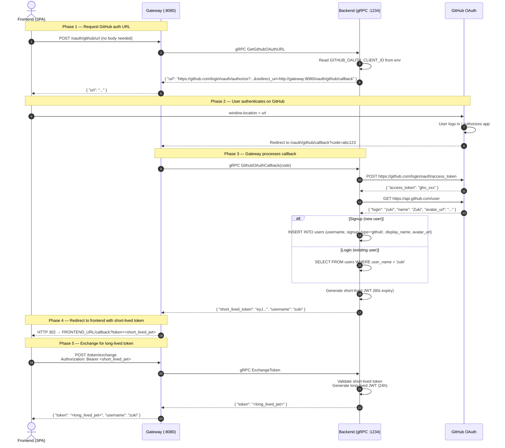

# GitHub OAuth Implementation Plan

This document details the step-by-step implementation plan for adding GitHub OAuth as an authentication provider. The database schema and type definitions already support `'github'` as a `signup_type` — this plan covers the networking, protocol, business logic, and frontend wiring.

---

## Architecture Overview

GitHub redirects back to the **gateway** (not the frontend). The gateway processes the code, then issues an HTTP 302 redirect to the frontend with a **short-lived** JWT (60s) in the query string. The frontend immediately exchanges it for a **long-lived** JWT (24h) via a dedicated endpoint.



**Key design decisions:**

| Decision | Rationale |
|----------|-----------|
| GitHub redirects to gateway, not frontend | Gateway handles the OAuth secret; frontend never sees the `code` exchange |
| Short-lived JWT (60s) in URL query string | Minimises exposure window if the URL leaks (browser history, referrer headers) |
| Long-lived JWT (24h) via `POST /token/exchange` | Standard JWT with `login_id` for durable consumer naming; never appears in a URL |
| `FRONTEND_URL` from environment variable | Already used for CORS; kept as the single source of truth for the frontend origin |
| `GITHUB_OAUTH_CLIENT_ID` / `GITHUB_OAUTH_CLIENT_SECRET` from env | Standard 12-factor; never hardcoded or exposed to the frontend |

---

## 1. Add OAuth2 Dependency

**File:** `backend/go.mod`

Add the `golang.org/x/oauth2` package.

```sh
go get golang.org/x/oauth2
```

---

## 2. Short-Lived Token Support in lib

**File:** `backend/internal/lib/jwt.go`

Add a parameterised `GenerateTokenWithExpiry` function so the backend can mint both short-lived (60s) and long-lived (24h) tokens with the same structure.

```go
// GenerateTokenWithExpiry signs a JWT for the given userID and username with a
// configurable expiry duration. Use 60*time.Second for OAuth redirect tokens
// and 24*time.Hour for session tokens.
func GenerateTokenWithExpiry(userID, username string, expiry time.Duration) (string, error) {
    claims := &Claims{
        UserID:   userID,
        Username: username,
        LoginID:  uuid.NewString(),
        RegisteredClaims: jwt.RegisteredClaims{
            ExpiresAt: jwt.NewNumericDate(time.Now().Add(expiry)),
            IssuedAt:  jwt.NewNumericDate(time.Now()),
        },
    }
    token := jwt.NewWithClaims(jwt.SigningMethodHS256, claims)
    return token.SignedString(jwtSecret())
}

// GenerateToken signs a JWT with a 24-hour expiry. Delegates to GenerateTokenWithExpiry.
func GenerateToken(userID, username string) (string, error) {
    return GenerateTokenWithExpiry(userID, username, 24*time.Hour)
}
```

`ValidateToken` already works for any valid JWT regardless of expiry — no changes needed.

---

## 3. Proto Changes

**File:** `backend/proto/auth/auth.proto`

Add three new RPCs and their message types:

```protobuf
// --- GitHub OAuth ---

message GetGithubOAuthURLRequest {
  // No fields. The gateway/backend knows its own callback URL from configuration.
}
message GetGithubOAuthURLResponse {
  string url = 1;
}

message GithubOAuthCallbackRequest {
  string code = 1;
}
message GithubOAuthCallbackResponse {
  string short_lived_token = 1;
  string username = 2;
}

// --- Token Exchange ---

message ExchangeTokenRequest {
  // Token arrives via gRPC metadata (Authorization: Bearer <short_lived_token>).
  // No body fields needed.
}
message ExchangeTokenResponse {
  string token = 1;     // long-lived JWT (24h)
  string username = 2;
}

service Auth {
  rpc Login(LoginRequest) returns (LoginResponse);
  rpc Signup(SignupRequest) returns (SignupResponse);
  rpc SearchUsers(SearchUsersRequest) returns (SearchUsersResponse);
  rpc GetGithubOAuthURL(GetGithubOAuthURLRequest) returns (GetGithubOAuthURLResponse);
  rpc GithubOAuthCallback(GithubOAuthCallbackRequest) returns (GithubOAuthCallbackResponse);
  rpc ExchangeToken(ExchangeTokenRequest) returns (ExchangeTokenResponse);
}
```

After editing, regenerate Go code:

```sh
cd backend && protoc --go_out=. --go-grpc_out=. proto/auth/auth.proto
```

---

## 4. gRPC Service Implementation

**File:** `backend/internal/services/auth_service.go`

Add three new methods to `AuthServer`.

### 4.1 `GetGithubOAuthURL`

- Reads `GITHUB_OAUTH_CLIENT_ID` from env (returns `InvalidArgument` if empty).
- Reads `GATEWAY_LISTEN_ADDRESS` from env (needed to build the redirect_uri).
  - **Note:** This is the *publicly reachable* address of the gateway, not the internal `:1234` backend address. If behind a reverse proxy, this must be the external URL.
  - Default: `http://localhost:8080`
- Constructs the GitHub authorization URL:
  ```
  https://github.com/login/oauth/authorize?
    client_id=<GITHUB_OAUTH_CLIENT_ID>&
    redirect_uri=<GATEWAY_PUBLIC_URL>/oauth/github/callback&
    scope=read:user
  ```
- Returns the URL in the response.

### 4.2 `GithubOAuthCallback`

- Reads `GITHUB_OAUTH_CLIENT_ID` and `GITHUB_OAUTH_CLIENT_SECRET` from env.
- Reads `GATEWAY_PUBLIC_URL` from env (or `GATEWAY_LISTEN_ADDRESS` as fallback).
- Exchanges the `code` for an access token:
  ```
  POST https://github.com/login/oauth/access_token
  Accept: application/json
  Body: client_id=<ID>&client_secret=<SECRET>&code=<code>
  ```
- Uses the access token to fetch the GitHub user profile:
  ```
  GET https://api.github.com/user
  Authorization: Bearer <access_token>
  ```
- Extracts `login` (username), `name` (display name), `avatar_url` from the response.
- **Signup path** (user does not exist in DB):
  - Opens a transaction.
  - Checks `GetUserByUsername` → if found, returns `AlreadyExists`.
  - Calls `CreateUser` with `signup_type = 'github'`, `hashed_passwd = NULL`.
  - Calls `UpdateUserProfile` to set `display_name` and `avatar_url`.
  - Commits transaction.
- **Login path** (user exists in DB):
  - Verifies `signup_type = 'github'` — returns `FailedPrecondition` if not.
- Generates a **short-lived JWT** (60-second expiry) via `lib.GenerateTokenWithExpiry(userID, username, 60*time.Second)`.
- Returns the short-lived token and username.

### 4.3 `ExchangeToken`

- The caller's short-lived token is extracted from gRPC metadata by the JWT interceptor (which injects `ContextKeyUserID` and `ContextKeyUsername`).
- Generates a **long-lived JWT** (24-hour expiry) via `lib.GenerateToken(userID, username)`.
- Returns the long-lived token and username.

### Error Handling Summary

| RPC | Scenario | gRPC Code |
|-----|----------|-----------|
| `GetGithubOAuthURL` | Missing `GITHUB_OAUTH_CLIENT_ID` | `InvalidArgument` |
| `GithubOAuthCallback` | Missing `code` | `InvalidArgument` |
| `GithubOAuthCallback` | Missing client ID/secret env vars | `Internal` |
| `GithubOAuthCallback` | GitHub token exchange fails | `Unauthenticated` |
| `GithubOAuthCallback` | GitHub user info fetch fails | `Internal` |
| `GithubOAuthCallback` | Username already taken (signup) | `AlreadyExists` |
| `GithubOAuthCallback` | User exists but `signup_type != 'github'` | `FailedPrecondition` |
| `GithubOAuthCallback` | DB error | `Internal` |
| `ExchangeToken` | Token expired/invalid (handled by interceptor) | `Unauthenticated` |

---

## 5. JWT Interceptor Whitelist

**File:** `backend/internal/interceptors/jwt.go`

Add the three new RPC methods to `publicMethods`:

```go
var publicMethods = map[string]bool{
    "/auth.Auth/Login":              true,
    "/auth.Auth/Signup":             true,
    "/auth.Auth/GetGithubOAuthURL":  true,
    "/auth.Auth/GithubOAuthCallback": true,
    // ExchangeToken is NOT public — it requires a valid short-lived token.
}
```

`ExchangeToken` is intentionally **not** in `publicMethods`. The caller must present the short-lived JWT, which the interceptor validates and uses to inject user identity into the context. This is how the backend knows *which* user to issue the long-lived token for.

---

## 6. Gateway gRPC Client

**File:** `backend/internal/clients/auth_client.go`

Add three new methods:

```go
func (a *AuthClient) GetGithubOAuthURL(ctx context.Context) (string, error) {
    resp, err := a.client.GetGithubOAuthURL(ctx, &auth.GetGithubOAuthURLRequest{})
    if err != nil {
        return "", err
    }
    return resp.Url, nil
}

func (a *AuthClient) GithubOAuthCallback(ctx context.Context, code string) (shortLivedToken, username string, err error) {
    resp, err := a.client.GithubOAuthCallback(ctx, &auth.GithubOAuthCallbackRequest{Code: code})
    if err != nil {
        return "", "", err
    }
    return resp.ShortLivedToken, resp.Username, nil
}

func (a *AuthClient) ExchangeToken(ctx context.Context, shortLivedToken string) (longLivedToken, username string, err error) {
    resp, err := a.client.ExchangeToken(
        lib.WithToken(ctx, shortLivedToken),
        &auth.ExchangeTokenRequest{},
    )
    if err != nil {
        return "", "", err
    }
    return resp.Token, resp.Username, nil
}
```

---

## 7. Gateway HTTP Handlers

**File:** `backend/internal/handlers/auth_handler.go`

Add three new handler methods on `AuthHandler`.

### 7.1 `GetGithubOAuthURL`

- **Route:** `POST /oauth/github/url`
- **Auth required:** No
- **Request body:** None (or empty JSON object for CORS preflight friendliness)
- **Response (200):**
  ```json
  {
    "success": true,
    "data": {
      "url": "https://github.com/login/oauth/authorize?client_id=...&redirect_uri=http://gateway:8080/oauth/github/callback&scope=read:user"
    }
  }
  ```

### 7.2 `GithubOAuthCallback`

- **Route:** `GET /oauth/github/callback`
- **Auth required:** No
- **Query parameter:** `?code=<authorization_code>` (set by GitHub)
- **Behavior:**
  1. Extracts `code` from `r.URL.Query().Get("code")`.
  2. If missing, renders an error page or redirects to `FRONTEND_URL?error=missing_code`.
  3. Calls `h.authClient.GithubOAuthCallback(ctx, code)`.
  4. On success: reads `FRONTEND_URL` from env, issues **HTTP 302 redirect** to:
     ```
     {FRONTEND_URL}/callback?token=<short_lived_token>
     ```
     The `token` parameter is the 60-second JWT.
  5. On error: redirects to `{FRONTEND_URL}?error=<url_encoded_message>`.

> **Why a GET with redirect instead of POST with JSON?**
> GitHub OAuth always redirects the browser (GET) to the registered callback URL. The gateway cannot change this to a POST. The gateway therefore handles it as a GET, processes the code, and then issues its own redirect to the frontend.

### 7.3 `ExchangeToken`

- **Route:** `POST /token/exchange`
- **Auth required:** Yes — `Authorization: Bearer <short_lived_jwt>`
- **Request body:** None
- **Behavior:**
  1. Extracts the short-lived JWT from the `Authorization` header via `lib.BearerToken(r)`.
  2. Calls `h.authClient.ExchangeToken(ctx, shortLivedToken)`.
  3. Returns the long-lived JWT and username.
- **Response (200):**
  ```json
  {
    "success": true,
    "data": {
      "token": "eyJhbG...",
      "username": "zuki"
    }
  }
  ```

### 7.4 Handler Code (Pseudocode)

```go
func (h *AuthHandler) GetGithubOAuthURL(w http.ResponseWriter, r *http.Request) {
    url, err := h.authClient.GetGithubOAuthURL(r.Context())
    if err != nil {
        grpcStatus, _ := status.FromError(err)
        lib.WriteJSON(w, http.StatusInternalServerError, lib.Response{Success: false, Message: grpcStatus.Message()})
        return
    }
    lib.WriteJSON(w, http.StatusOK, lib.Response{Success: true, Data: map[string]string{"url": url}})
}

func (h *AuthHandler) GithubOAuthCallback(w http.ResponseWriter, r *http.Request) {
    frontendURL := lib.Getenv("FRONTEND_URL", "")
    code := r.URL.Query().Get("code")
    if code == "" {
        http.Redirect(w, r, frontendURL+"?error=missing_code", http.StatusFound)
        return
    }
    shortLivedToken, username, err := h.authClient.GithubOAuthCallback(r.Context(), code)
    if err != nil {
        grpcStatus, _ := status.FromError(err)
        http.Redirect(w, r, frontendURL+"?error="+url.QueryEscape(grpcStatus.Message()), http.StatusFound)
        return
    }
    _ = username // available if needed in the redirect
    http.Redirect(w, r, frontendURL+"/callback?token="+url.QueryEscape(shortLivedToken), http.StatusFound)
}

func (h *AuthHandler) ExchangeToken(w http.ResponseWriter, r *http.Request) {
    shortLivedToken, ok := lib.BearerToken(r)
    if !ok || shortLivedToken == "" {
        lib.WriteJSON(w, http.StatusUnauthorized, lib.Response{Success: false, Message: "missing or malformed Authorization header"})
        return
    }
    longLivedToken, username, err := h.authClient.ExchangeToken(r.Context(), shortLivedToken)
    if err != nil {
        grpcStatus, _ := status.FromError(err)
        switch grpcStatus.Code() {
        case codes.Unauthenticated:
            lib.WriteJSON(w, http.StatusUnauthorized, lib.Response{Success: false, Message: grpcStatus.Message()})
        default:
            lib.WriteJSON(w, http.StatusInternalServerError, lib.Response{Success: false, Message: grpcStatus.Message()})
        }
        return
    }
    lib.WriteJSON(w, http.StatusOK, lib.Response{
        Success: true,
        Data:    map[string]string{"token": longLivedToken, "username": username},
    })
}
```

### 7.5 New Request Types

**File:** `backend/internal/handlers/types.go`

```go
type exchangeTokenRequest struct {
    // No body fields — token is in the Authorization header
}
```

The `oauthURLRequest` and `oauthCallbackRequest` structs from the previous plan are no longer needed (no JSON body for either endpoint).

---

## 8. Gateway Route Registration

**File:** `backend/cmd/gateway/main.go`

Add the three new routes:

```go
r.HandleFunc("/oauth/github/url", authHandler.GetGithubOAuthURL).Methods(http.MethodPost)
r.HandleFunc("/oauth/github/callback", authHandler.GithubOAuthCallback).Methods(http.MethodGet)
r.HandleFunc("/token/exchange", authHandler.ExchangeToken).Methods(http.MethodPost)
```

---

## 9. Backend Service Registration

**File:** `backend/cmd/backend/main.go`

No changes needed. The existing `auth.RegisterAuthServer(srv, services.NewAuthServer(sqlDB))` picks up all methods of the `Auth` service automatically.

---

## 10. CORS Configuration

**File:** `backend/cmd/gateway/main.go`

The existing CORS configuration already allows `GET`, `POST`, and the headers `Content-Type`, `Authorization`. No changes needed.

> The `/oauth/github/callback` endpoint is accessed via a browser redirect from GitHub (a top-level navigation), not an XHR/fetch request, so CORS does not apply.

---

## 11. Frontend Integration

### 11.1 Start OAuth Flow

1. User clicks "Login with GitHub" or "Sign up with GitHub".
2. Frontend calls `POST /oauth/github/url` (no body).
3. On success, redirect the browser to the returned URL:
   ```ts
   window.location.href = response.data.url;
   ```

### 11.2 Handle Callback (frontend page at `/callback`)

1. GitHub has redirected through the gateway; the browser now lands on `{FRONTEND_URL}/callback?token=<short_lived_jwt>`.
2. Frontend extracts `token` from the URL query string:
   ```ts
   const params = new URLSearchParams(window.location.search);
   const shortLivedToken = params.get("token");
   ```
3. Frontend immediately calls `POST /token/exchange`:
   ```ts
   const res = await fetch("/token/exchange", {
     method: "POST",
     headers: { "Authorization": `Bearer ${shortLivedToken}` },
   });
   const data = await res.json();
   ```
4. On success, store the long-lived JWT (cookie/localStorage) and `loggedin_username` (cookie) per the existing auth flow.
5. Clean the token from the URL (replace state) to remove it from browser history:
   ```ts
   window.history.replaceState({}, "", "/callback");
   ```
6. Navigate to the chat view.

### 11.3 Error Handling

If the redirect lands with `?error=...` (e.g., `{FRONTEND_URL}/?error=github+auth+failed`), the frontend should display the error message and offer a retry link.

### 11.4 Frontend Routes

| Route | Description |
|-------|-------------|
| `/callback` | Receives the final redirect from gateway with `?token=<short_lived_jwt>`; exchanges it for a long-lived token |

---

## 12. Files Changed Summary

| File | Change |
|------|--------|
| `backend/go.mod` | Add `golang.org/x/oauth2` dependency |
| `backend/internal/lib/jwt.go` | Add `GenerateTokenWithExpiry` function; refactor `GenerateToken` to delegate to it |
| `backend/proto/auth/auth.proto` | Add `GetGithubOAuthURL`, `GithubOAuthCallback`, `ExchangeToken` RPCs + messages |
| `backend/proto/auth/` (generated) | Regenerate with `protoc` after proto changes |
| `backend/internal/services/auth_service.go` | Implement `GetGithubOAuthURL`, `GithubOAuthCallback`, `ExchangeToken` |
| `backend/internal/interceptors/jwt.go` | Add `GetGithubOAuthURL` and `GithubOAuthCallback` to `publicMethods` |
| `backend/internal/clients/auth_client.go` | Add `GetGithubOAuthURL`, `GithubOAuthCallback`, `ExchangeToken` client methods |
| `backend/internal/handlers/auth_handler.go` | Add `GetGithubOAuthURL`, `GithubOAuthCallback`, `ExchangeToken` HTTP handlers |
| `backend/internal/handlers/types.go` | Add `exchangeTokenRequest` struct (if needed) |
| `backend/cmd/gateway/main.go` | Register 3 new routes |
| `docs/github_oauth_plan.md` | This document |
| Frontend (out of scope for this plan) | OAuth button, `/callback` page, token exchange logic, URL cleanup |

---

## 13. Environment Variables

| Variable | Service | Required | Description |
|----------|---------|----------|-------------|
| `GITHUB_OAUTH_CLIENT_ID` | Backend | Yes | GitHub OAuth App client ID |
| `GITHUB_OAUTH_CLIENT_SECRET` | Backend | Yes | GitHub OAuth App client secret |
| `GATEWAY_PUBLIC_URL` | Backend | Yes | Publicly reachable gateway URL (e.g., `http://localhost:8080`). Used to build the `redirect_uri` for GitHub. Falls back to `GATEWAY_LISTEN_ADDRESS`. |
| `FRONTEND_URL` | Gateway | Yes | Frontend origin — used for CORS and as the OAuth final redirect target |
| `JWT_SECRET` | Backend | Yes (existing) | HMAC-SHA256 signing key for JWTs |

---

## 14. Database Changes

**None required.** The `users` table, `signup_type` enum (`'github'`), and nullable `hashed_passwd` already support GitHub OAuth accounts. The service calls `UpdateUserProfile` after `CreateUser` to set `display_name` and `avatar_url` from the GitHub profile.

---

## 15. Security Considerations

| Concern | Mitigation |
|---------|------------|
| Short-lived JWT in URL | 60-second expiry; frontend replaces history state (`history.replaceState`) after extracting the token |
| Referrer leakage | The `/callback` page uses `replaceState` before any navigation; no external resources on the page |
| CSRF on `/token/exchange` | The short-lived JWT serves as a one-time exchange token — it is single-use in practice due to 60s expiry |
| GitHub `state` parameter | The plan does not currently use the OAuth `state` parameter for CSRF protection on the GitHub→Gateway leg. This should be added as a follow-up: generate a random `state` in `GetGithubOAuthURL`, store it server-side (or in a signed cookie), and validate it in `GithubOAuthCallback`. |

---

## 16. Testing Checklist

- [ ] `POST /oauth/github/url` returns a valid GitHub authorization URL pointing at the gateway callback.
- [ ] Redirecting to that URL presents the GitHub authorization page.
- [ ] After authorizing on GitHub, browser lands on `FRONTEND_URL/callback?token=<short_lived_jwt>`.
- [ ] Short-lived JWT is valid for ~60 seconds.
- [ ] `POST /token/exchange` with the short-lived JWT returns a long-lived JWT and username.
- [ ] Long-lived JWT works for authenticated requests (friends list, chat, etc.).
- [ ] Signup: a new user is created with `signup_type = 'github'`, `display_name`, and `avatar_url` from GitHub.
- [ ] Login: an existing GitHub user receives a new long-lived JWT.
- [ ] Error: invalid/expired `code` redirects to frontend with `?error=...`.
- [ ] Error: email-signed-up username used for GitHub signup returns 409 → redirect with error.
- [ ] Error: attempting GitHub login on an email-created account → redirect with error.
- [ ] Error: expired short-lived token on `/token/exchange` returns 401.
- [ ] Missing `GITHUB_OAUTH_CLIENT_ID`/`GITHUB_OAUTH_CLIENT_SECRET` returns 500 with a clear message.
- [ ] Token in URL is removed from browser history after exchange.
