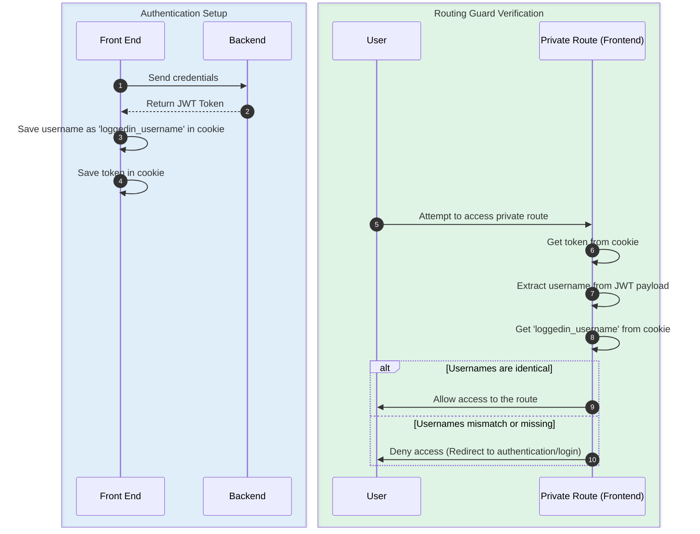
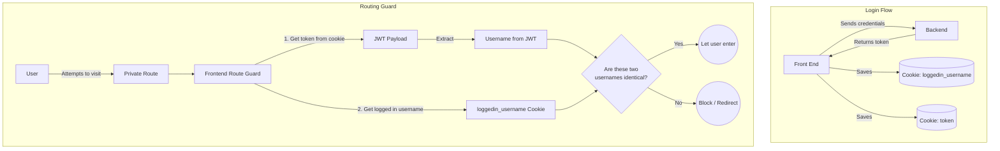

# Routing Guard Flow

This document details the authentication and routing guard flow for the front end.

## Flow Diagrams

### 1. Sequence Diagram
The following sequence diagram outlines the entire process from logging in to verifying access against a private route.

### 2. Flowchart
A step-by-step visual map based on the required guard logic:

